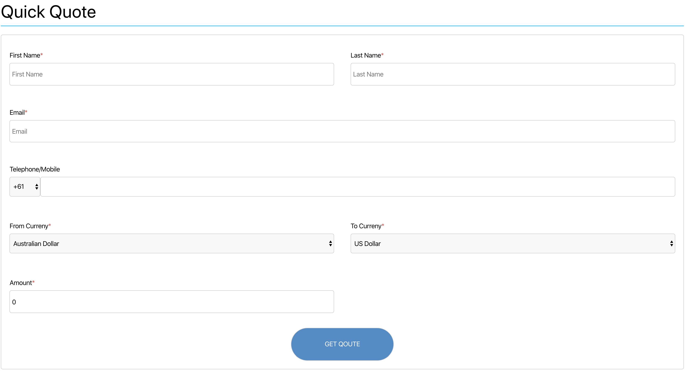
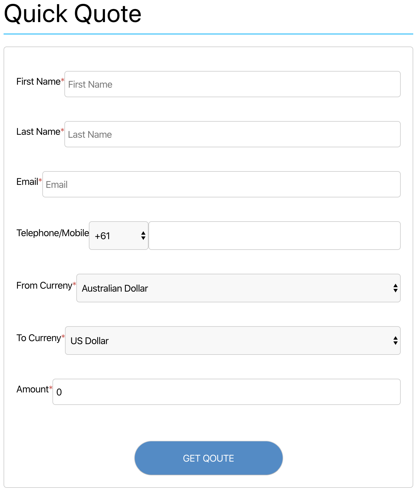

# OFX Quote

OFX quote allows the user to quickly find out the latest quote for their requests

## Responsive

The Current web application works for large as well as small screen

<figure>
  
  <figcaption>full screen</figcaption>
</figure>

<figure>
  
  <figcaption>small screen</figcaption>
</figure>

## Things to be improved

- More unit tests code coverage (due to time limite current project has limited coverage)

- CI/CD pipleline

- automated end-to-end tests

## Tech Stack

- React [https://reactjs.org/](https://reactjs.org/)
- Jest [jest](https://jestjs.io/)

## Getting Started

### Prerequisites

- Node.js

In the project directory, first run

`yarn install` or `npm install`

and then you can run:

### `yarn start`

Runs the app in the development mode. 
Open [http://localhost:3000](http://localhost:3000) to view it in the browser.

The page will reload if you make edits. 
You will also see any lint errors in the console.

### `yarn test`

Launches the test runner in the interactive watch mode.
See the section about [running tests](https://facebook.github.io/create-react-app/docs/running-tests) for more information.

## Authors

- **Chao Wang**
